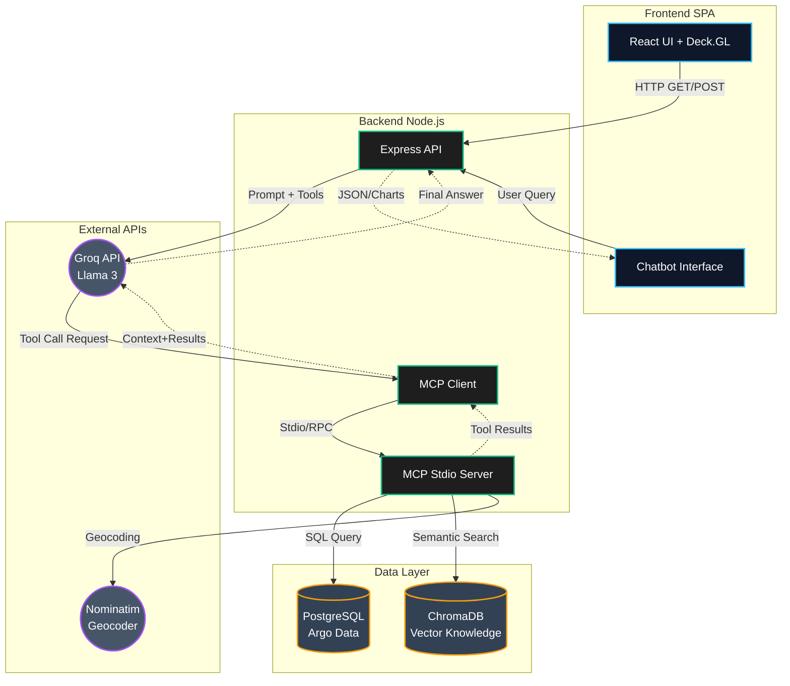
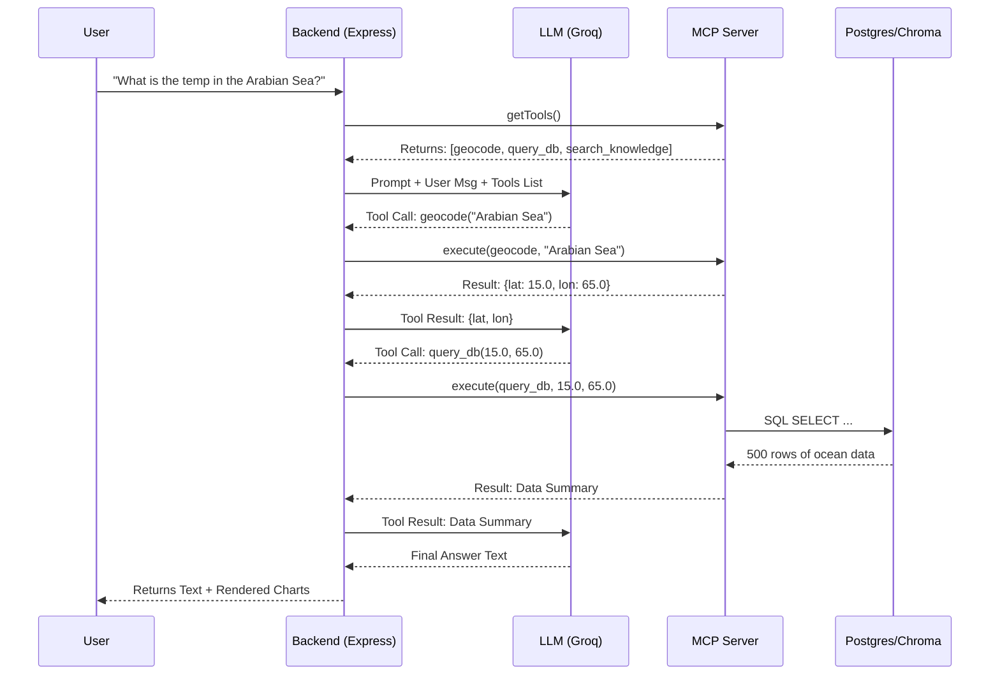

# 🌊 FloatChat (SIH-40)
**AI-Powered Conversational Interface for ARGO Ocean Data Discovery and Visualization**

**FloatChat** is a comprehensive full-stack application built for the Smart India Hackathon (SIH). It democratizes access to complex global oceanographic data from Argo floats. It features a stunning "Deep Ocean / Cyber-Nautical" aesthetic, interactive 3D maps, depth profiles, and an integrated **Retrieval-Augmented Generation (RAG)** pipeline powered by the **Model Context Protocol (MCP)**. 

Users can talk to the system in natural language to fetch, visualize, and understand ocean data without needing any SQL or domain expertise.

---

## ✨ Key Features in Detail

1. **AI Chatbot Assistant with RAG**
   - Built on a RAG (Retrieval-Augmented Generation) pipeline using the Llama 3 LLM (via Groq).
   - **Semantic Search:** Uses a local **ChromaDB Vector Database** to fetch and understand complex oceanographic metadata and definitions (e.g., "What is a BGC float?").
   - Context-aware conversations allow users to ask general knowledge questions alongside data requests.

2. **Autonomous Tool Calling via Model Context Protocol (MCP)**
   - The backend runs an official **MCP Server** that exposes standard tools (`query_argo_database`, `search_ocean_knowledge`, `geocode_location`).
   - The LLM autonomously acts as an agent: when a user asks for data in the "Arabian Sea", the LLM autonomously triggers the geocoder, queries the PostgreSQL database, analyzes the data, and returns human-readable results.

3. **Interactive 3D Ocean Maps**
   - High-performance, edge-to-edge map visualizer built using **Deck.GL** and **React Map GL**.
   - Renders thousands of ARGO float locations globally in real-time.

4. **Data Dashboards & Profiles**
   - Detailed Recharts/D3.js-based charts and depth profiles (e.g., Temperature vs. Depth, Salinity vs. Depth).
   - **Data Export:** Users can download the AI-extracted data directly as CSV files for local scientific analysis.

5. **Robust Data Pipeline**
   - A Node.js and PostgreSQL backend capable of directly parsing and ingesting raw NetCDF (`.nc`) files from the international Argo program.

6. **Cyber-Nautical UI**
   - A meticulously crafted glassmorphic dark-mode user interface designed to feel like a modern submarine HUD.

---

## 🏗️ System Architecture

The application is built on a modern Agentic architecture, separating the client interface, the orchestrator, the tool server, and the databases.



---

## 🔄 RAG & Tool Calling Flowchart

When a user asks a question, the system determines the best path to answer it dynamically.



---

## 🛠️ Tech Stack

### Frontend (`frontend_sid/`)
- **Framework:** React 19 + Vite
- **Styling:** Tailwind CSS + Custom Vanilla CSS variables
- **Visualization:** Deck.GL, React Map GL, MapLibre GL, Recharts
- **Icons & Assets:** Lucide React

### Backend (`backend_sid/`)
- **Server:** Node.js + Express
- **AI Agent Protocol:** `@modelcontextprotocol/sdk` (MCP Server & Client)
- **Database:** PostgreSQL (with `pg` driver)
- **Vector Database:** ChromaDB
- **LLM Provider:** Groq (Llama 3)
- **Data Processing:** `netcdfjs` for `.nc` ingestion

---

## 🚀 Getting Started

### Prerequisites
- Node.js (v18+ recommended)
- PostgreSQL (running locally)
- Docker (for running ChromaDB)
- Groq API Key

### 1. Vector Database Setup (ChromaDB)
You must run the vector database to support the AI's semantic knowledge retrieval.
1. Start the Docker container:
   ```bash
   docker run -p 8000:8000 chromadb/chroma
   ```
2. Inject the initial knowledge base:
   ```bash
   cd backend_sid
   node setup_vector_db.js
   ```

### 2. Backend Setup (PostgreSQL & Node.js)
1. Navigate to the backend directory:
   ```bash
   cd backend_sid
   npm install
   ```
2. Setup PostgreSQL database `argo_data` and configure `.env`:
   ```bash
   GROQ_API_KEY=your_groq_api_key_here
   ```
3. Initialize tables and ingest `.nc` data:
   ```bash
   npm run create:table
   npm run insert:argo
   ```
4. Start the API & MCP Server:
   ```bash
   node server.js
   ```

### 3. Frontend Setup
1. Navigate to the frontend directory:
   ```bash
   cd frontend_sid
   npm install
   ```
2. Start the Vite development server:
   ```bash
   npm run dev
   ```
3. Open `http://localhost:5173` to explore FloatChat!

---

*Built for the Smart India Hackathon (SIH-40).*
